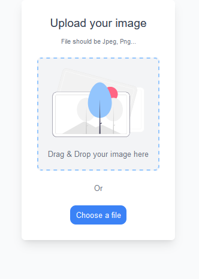
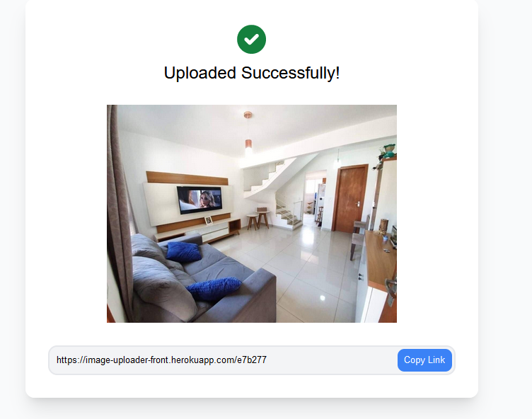

# [Image Uploader](https://image-uploader-front.herokuapp.com/)

## **Tecnologias utilizadas**

### **[React ⚛️ v17](https://create-react-app.dev/)**

> Biblioteca principal para criação do app.

### **[axios v0.26](https://github.com/axios/axios)**

> Utilizado para se comunicar com a [API](https://github.com/beto-machado/Image-Uploaders-Api).

### **[Tailwind CLI v3.0.23](https://tailwindcss.com/docs/installation)**

> Framework CSS que evita a criação de arquivo CSS com classes não utilizadas.

## **Páginas**

### **Home Page**

> Na página inicial é possível fazer o upload de uma imagem cuja extensão seja jpeg, jpg ou png. O usuário pode arrastar e soltar a imagem ou utilizar a ferramenta de escolher arquivo.

### **Upload Completo**

> Quando o upload é finalizado, o app mostra um preview da imagem e um link para compartilhamento

